# Welcome to Onekana Online Manual

## Mobile Application

### System Overview
Onekana Digital attendance is an application that allows teachers to digitally record pupils’ class attendance. The application submits the data to an online cloud storage. 

### Organisation of the Manual
The user’s manual consists of five sections:

- System Summary
- Getting Started
- Using The System
- Reporting
- Web Dashboard

The **System Summary section** provides a general overview of the system. The summary outlines the uses of the system’s hardware and software requirements, system’s configuration, user access levels and system’s behavior in case of any contingencies. **Getting Started section** explains how to get Digital Attendance and install it on the device. The section presents briefly system menu. **Using The System section** provides a detailed description of system functions.**Reporting section** describes in what way information collected by the application are presented and how to access the information.

### System Summary
System Summary section provides a general overview of the system. The summary outlines the uses of the system’s hardware and software requirements, system’s configuration, user access levels and system’s behavior in case of any contingencies.

####  System Configuration
Digital Attendance operates on mobile devices with Android operating system. It is compatible with **Android version 5.1** and up. The application requires an Internet connection in order to save data to the cloud database,and also has an **offline functionality** to facilitate collection of attendance data without internet connection. **Offline mode works up to 30 days.** Data saved is visualised on a web dashboard accessible via any major Internet browser. After installation on the device, Digital Attendance can be use immediately without any further configuration.

####  User Access Levels
Only teachers that have been registered into the system can use the application. For any assistance with credentials, kindly consult the headteacher in your school.

### Getting Started

#### Installation
The Getting Started section explains how to install the Onekana Digital Attendance app on a device. To Download the mobile application, head to the Google Playstore on an Android device and search for “Onekana Digital Attendance”. To access the application on the PlayStore, click [Onekana Play Store](https://play.google.com/store/apps/details?id=com.moekedaapp.org).

#### Login

The newest installation version currently available can be downloaded from the Google Store and is an .apk file, which should be installed on the device.   
Login using a school's EMIS code or phone number and a password assigned to the teacher at installation level via the attached school’s or teacher’s email address. The teacher can then use these credentials to login.

##### Login Screen

Proceed with your login by inputting your school code or phone number as the username and the password sent to your email address. Click the login button to authorise the credentials.

##### Forgot Password

In the case of a forgotten password, click the Forgot Password button on the login page and enter your school code or phone number in the Forgot Password screen.

 Once successful, enter the reset code sent to your email address. Here is a sample email. 
 
 

Enter your new password and confirm the new password. Click the set new password button to complete the password reset process.

 

##### Marking Attendance

 

The attendance tab contains a list of learners with their name, UPI number / Admission number and an indicator of their gender or any special needs the learner might have. 

A **green M** badge indicates a male learner, **green F** a female learner and a **green SNE** illustrates a learner with special needs. 

 

To mark a learner as present, click the red circle on the right against the learner’s name to turn it to checked. Otherwise, not clicking the circle indicates that a learner is absent. After going through the list of learners in your class, click the **‘submit’** button to complete marking attendance.

###### Classes Menu 

 

On the top right, there’s a menu icon with a list of classes. A teacher can switch to a different classroom and mark attendance for that class room.

###### Date Picker

 

Change the attendance date by clicking on the calendar above the list of learners.

###### Daily Attendance Report

 

After marking attendance, a daily attendance report provides an overview of the marked learners status for that class. The report shows a chart of present vs absent learners and these numbers segmented by gender.

##### My School

 

The My School tab enables a headteacher to manage their school. Here, they can **Add / Edit Learners**, **View More Learner Details** and **Move / Promote Learners**. In this section you can also **Add / Edit Teachers** and **Add / Edit Classrooms** to a school.

###### Adding a Learner

 

A headteacher or an teacher admin can **add**, **edit** and **deactivate** a learner.  
Click on the “+” button to add a new learner. The add learner form has a list of different form inputs to fill as a teacher. Required fields are marked by a red *. The add learner form is divided into two parts :-

- Learner Details

 

- Guardian Details

 

###### Editing a Learner

Click on the **Edit** button to update the details of a Learner.

###### Deactivating a Learner

Deactivate Learner by clicking on the "Deactivate" button. 

You will receive a pop up that prompts for submission of a reason of deactivation for the learner. Select the correct reason and click on "Deactivate".

##### View Learner Details

View an attendance chart of the current attendance status of the learner and a phone call support feature as a means to reach a guardian. Clicking on **View Learner Details** will open a page with a list of learners displaying the learner's **name**, the **UPI/Admission Number**, a link to **View Attendance Chart** and a **Phone** Guardian button.

###### View Attendance Chart

The weekly attendance chart shows a weekly attendance overview of an individual learner, the days present against the days of absent. The retention rate is the probability value calculated by the number of days the learner was present while the dropout rate is the probability of dropping out calculated on absenteeism.

###### Contact Guardian

Incase of an emergency or need to follow up on a learner with their guardian, click on the **phone** icon to place a call.  

##### Move Learners

The Move Learners tab enables moving of learners from one class to another. Select learners to move to a different class and complete the move process. 

##### Promote Learners

Graduate learners to the next grade at the end of the year. This feature works to promote all learners to the next grade once. **Be careful** when promoting learners.

##### Teachers
###### Add Teachers

As a headteacher / teacher admin, add a new teacher to your school and assign a class to mark attendance. 

Fill the teacher details and submit the information by clicking the **Add Teacher** button.

###### Edit Teachers

Update the details of your exiting teacher by clicking the **Edit** button and updating your form. 

###### Deactivate Teachers

Deactivate a teacher from the system by clicking on the **Deactivate** button.

##### Classes

###### Add Classes

As a headteacher / teacher admin, you can easily add a new class to your school. 

Click on the add button to fill in the details of the new class you want to add. 

###### Edit Classes

Update the details of your exiting classes by clicking the **Edit** button and updating your form. 

###### Decativate Classes

Deactivate a class from the system by clicking on the **Deactivate** button.

##### Reports

The Reports tab allows the head teacher to view an aggregated list of student attendance perfomance per class, based on gender. Head-teacher's can also view on a daily basis a list of often absent students from every class on a certain date and provide a reason for absence for missing school.

###### View Absent Student Details

A list of frequently absent student can be found at the bottom of the page. Provide a reason for absence for each learner to ensure adequate follow up with the guardian and other partners. 

##### Profile

###### User Profile

The user profile tab allows the user to change their password, view notifications, sync off-line attendance with the database, update the latest class list as well as logging out and accessing the help pages.

###### Edit Password

In the User Profile tab, click on the Edit Password option. This will provide fields to enter the current password and the new password. Enter the current password and the new password respectively and click on the Login button.

###### Application Settings

###### Attendance Status

A user can sync attendance data taken in off-line mode to the online database by navigating to the user profile tab and clicking “Attendance Status”.

###### Update Learners List

This enables a teacher to manually sync to the latest learners list in the school. Click on the **Download Latest Class List** button to sync with the latest list of student in your school.*** Do this incase you perform offline learner enrolment with different devices. ***

###### Help & Support 

Access a list of frequently asked questions and
a user manual with more information on how to operate the Onekana Digital Attendance System.

###### Contact Us

Click on the **Contact Us** button to get a form to submit any issues/queries and support questions and our team will respond promptly. 

###### Download User Manual

Download a PDF version of this user manual by clicking on the **Download User Manual** button. 

###### Logout

To log out from the application, go to the User Profile tab and click on the Logout option.

## Web  Dashboard

###### Login

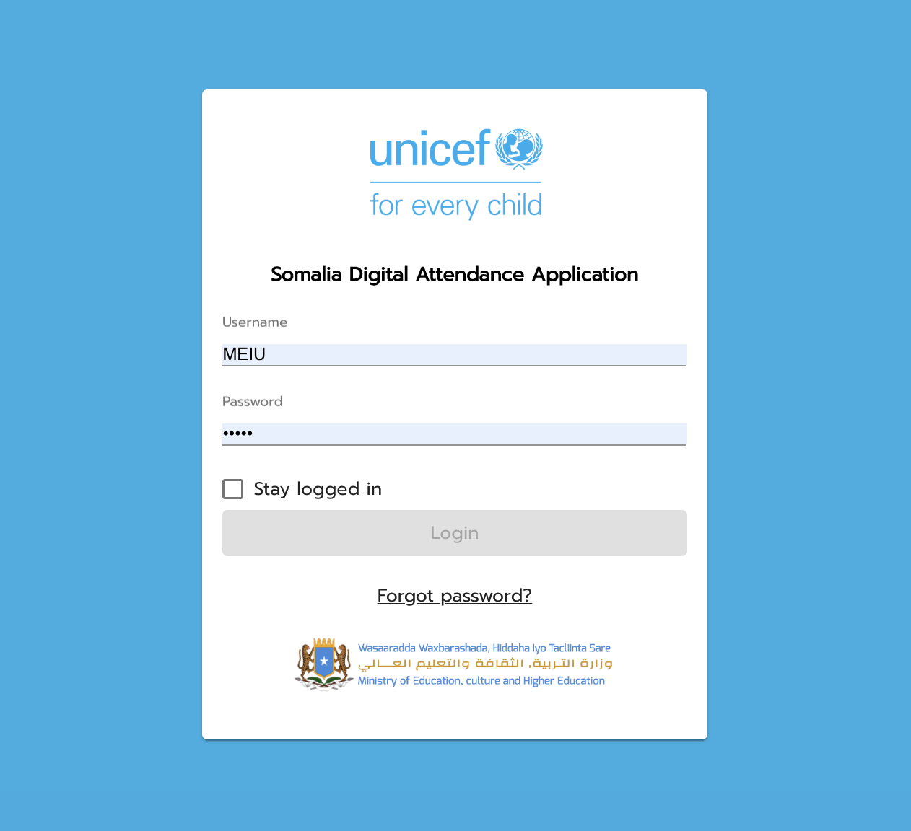

Onekana Digital Attendance's dashboard is hosted at [Onekana Dashboard](https://onekana.naconek.ke/). Enter your login credentials to access the dashboard.
###### Dashboard

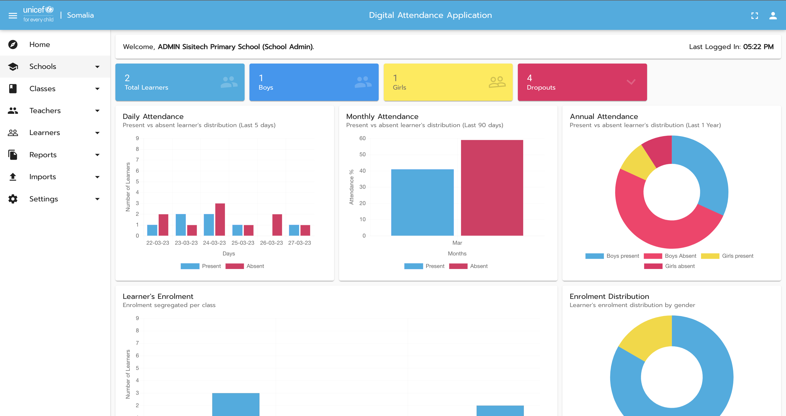

The dashboard consists of 7 naviagation items :- 

| Item | Description |
| :------ | :------ |
| Home | Provides an overview of all the learner's enrolment and attendance depending on the access level of the user. This is represented by charts and graphs. |
|Schools | Add a new school and view details of previously added schools|
|Classes | Add a new class to a school and view details of previously added classes|
|Teachers | Add a new teacher to a school and view details of previously added teachers. You can also reset the teachers password.|
|Learners | Add a new learner to a school and view details of previously added learners.|
|Reports | Generate enrolment and attendance reports as well as download Excel reports for offline use and data analysis.|
|Settings | View the logged in user profile as well as change their password.|

###### Home

View a card summary of learner enrolment data by gender.  

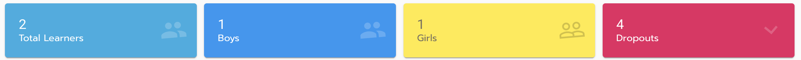

View a chart summary of monthly and annual attendance data.  

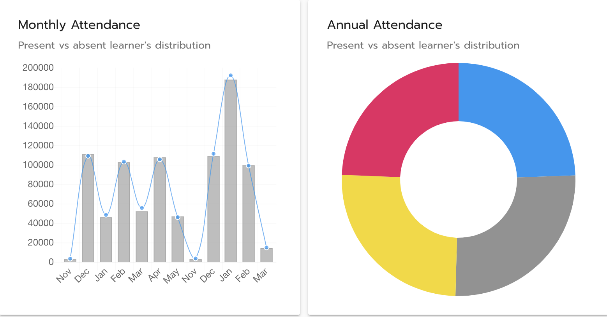

View a chart summary of learner enrolment by class.  

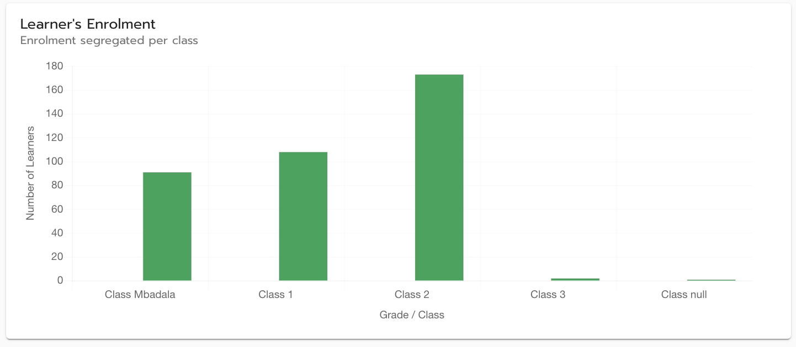

View a chart summary of learner enrolment data by gender.  

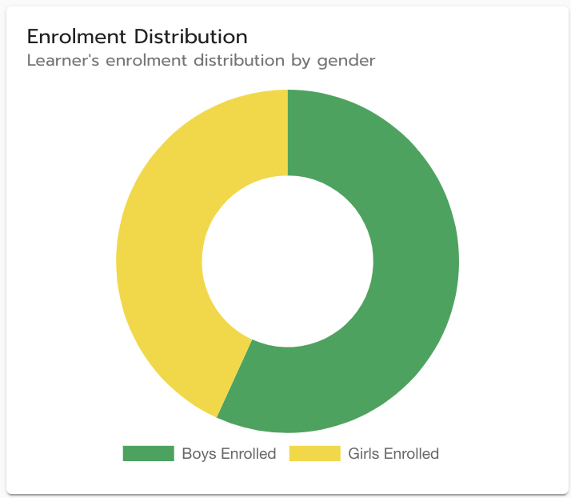

###### Schools

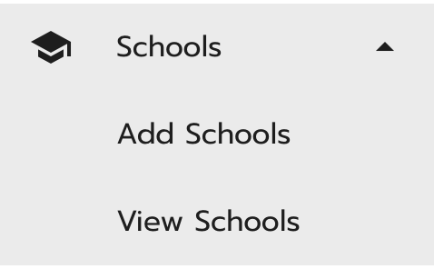

Add details of a new school to add it to the Onekana dashboard.The details include :- 

| Item | Required | Description |
| :------ | :------ | :------ |
|School Name | Yes | Provide the name of the school|
|School's EMIS Code | Yes | Provide the school's unique EMIS code|
|Phone Number| Yes | Provide the phone number to access the headteacher of the school|
|Email Address| No | Provide the email address of the school |
|School Category| No |Select between rural and urban |
|School Type | No |Select between male, female and mixed |
|School Sub County | No | Select the school's sub county |

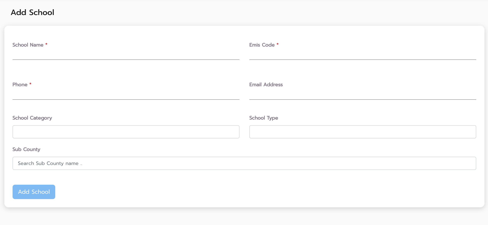

View current schools details. Filter by sub county to search for your school. You can also export the summary of the data. 

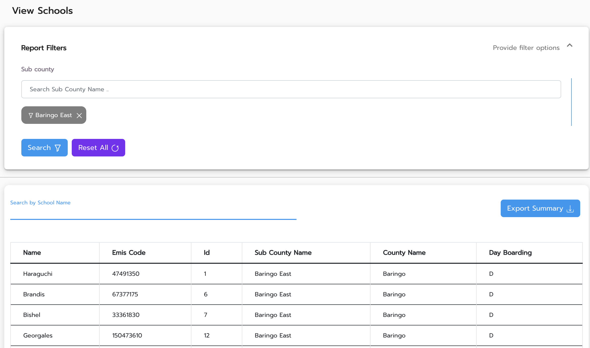

###### Classes

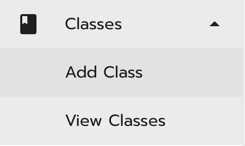

Add details of a new class to add it to the Onekana dashboard.The details include :- 

| Item | Required | Description |
| :------ | :------ | :------ |
|Assign School | Yes | Search your school name |
|Base Class | Yes | Add the standard grade / class i.e. 1,2,3 etc|
|Stream | No | Add a description for your base class i.e. East, West etc|

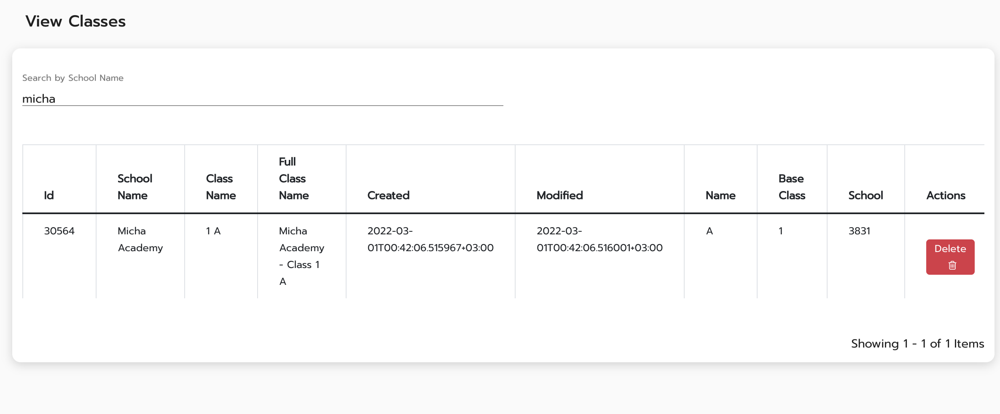

View all the classes added to a school by filtering by school. You can also delete a class. 

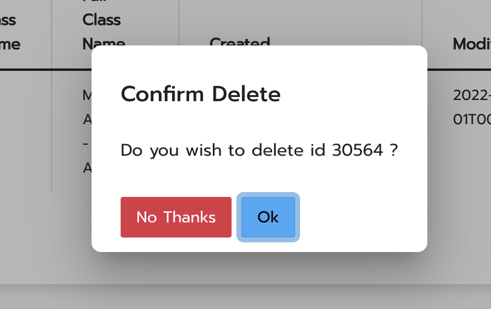

###### Teachers

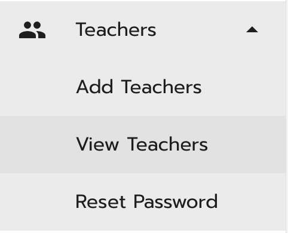

Add details of a new teacher to add them to the Onekana dashboard.The details include :- 

| Item | Required | Description |
| :------ | :------ | :------ |
|Assign School | Yes | Search your school name |
|First Name | Yes | Teacher's first name |
|Middle Name | No | Teacher's middle name|
|Last Name | Yes | Teacher's last name|
|Phone Number | Yes | Teacher's phone number|
|Email | No | Teacher's email address|
|Date of Birth | No | Teacher's date of birth|
|Teacher Type | No | Select either TSC /Board|
|TSC Number | No | Applies for TSC Type teachers|
|Streams | No | Assign a stream/s to mark attendance|
|Is School Admin | No | Check to assign teacher role to mark attendance for all classes|

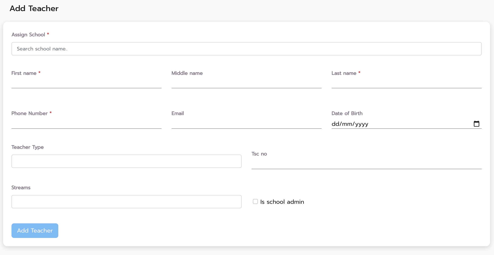

View teacher details by filtering the teacher's school sub county and searching the teacher's name from the table. This data summary can as well be exported. 

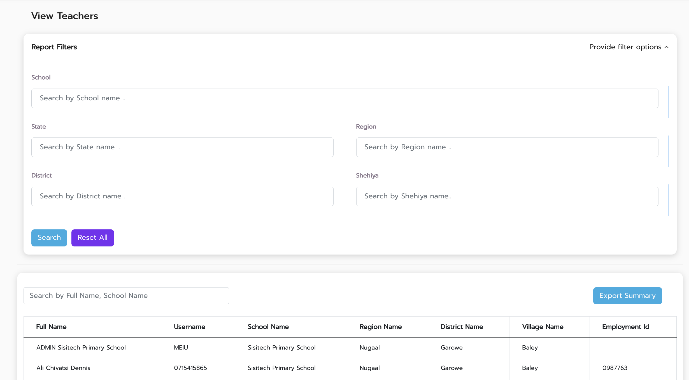

###### Learners

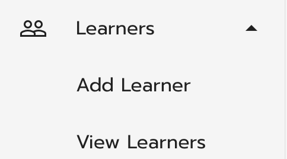

Add details of a new learner to add them to the Onekana dashboard.The details include :- 

| Item | Required | Description |
| :------ | :------ | :------ |
|First name | Yes | Learner's first name |
|Middle Name | No | Learner's middle name |
|Last Name | No | Learner's last name|
|Gender | No | Select learner's gender. Between Male or Female |
|Status | No | Select the learner's status. Either Not set, Out of School, Newly Enrolled, Never Enrolled or Previously Enrolled|
|Date of Birth | No | Learner's date of birth|
|UPI Number | No | Learner's unique UPI number |
|Admission Number | No | Learner's unique admission number |
|Learner's Sub County | No | The sub-county the learner originates from |
|Learner's village | No | The village the learner originates from|
|Learner's special needs | No | Select a special need for a learner with special needs|
|Distance from school (Km) | No | The distance between where the learner lives and school in kilometres|
|Guardian name | No | The name of the learner's guardian |
|Guardian status | No | The status of the learner's guardian. Either both parents, single parent, none or not set|
|Guardian phone | No | The phone number of the learner's guardian |
|Guardian email | No | The email address of the learner's guardian |
|Guardian sub county | No | The sub county the learner's guardian originates from |

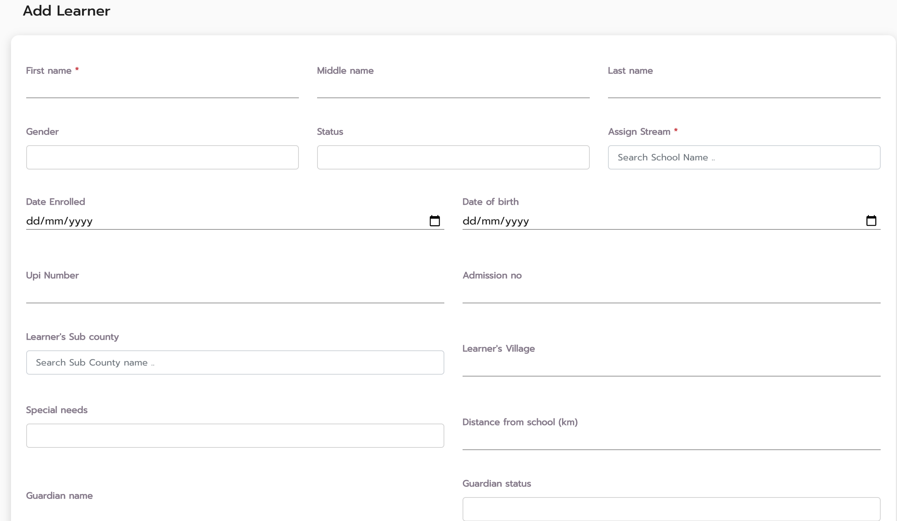

View added learners details filtered and grouped by county, sub county, class, school , age etc. 

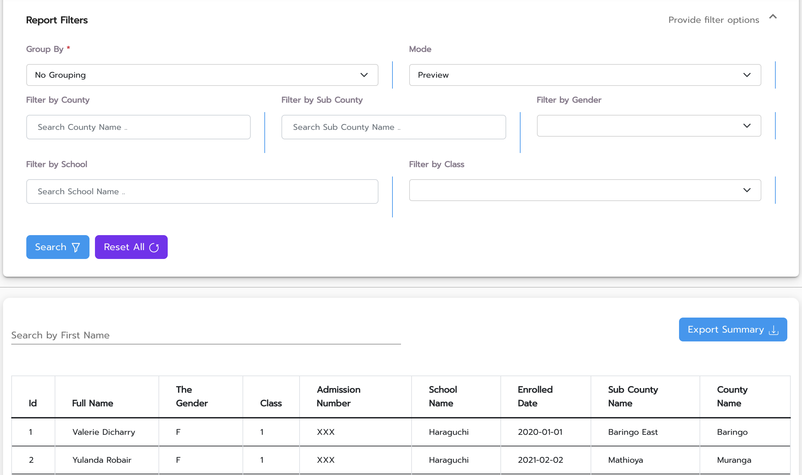

###### Reports

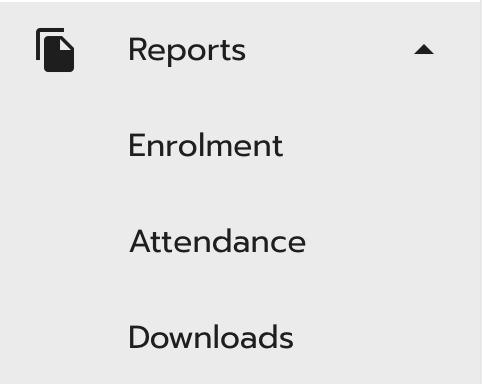

Select to view and generate either enrolment or attendance data reports. Filter and group your reports by county, sub county, class, school , age etc. You can also export and download a report summary. 

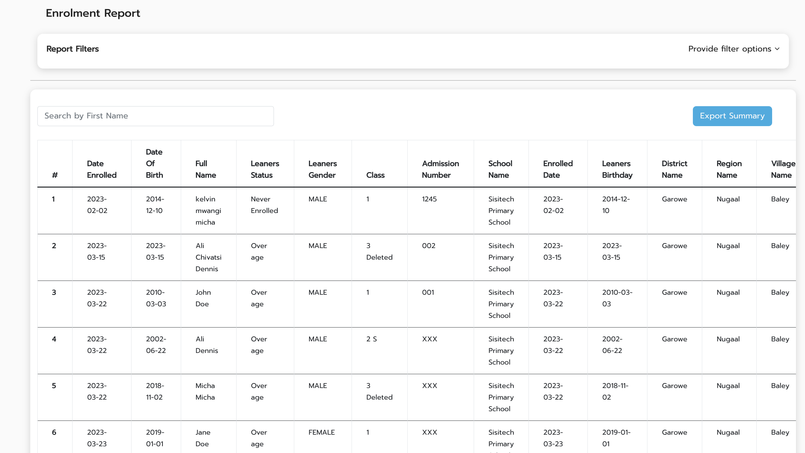

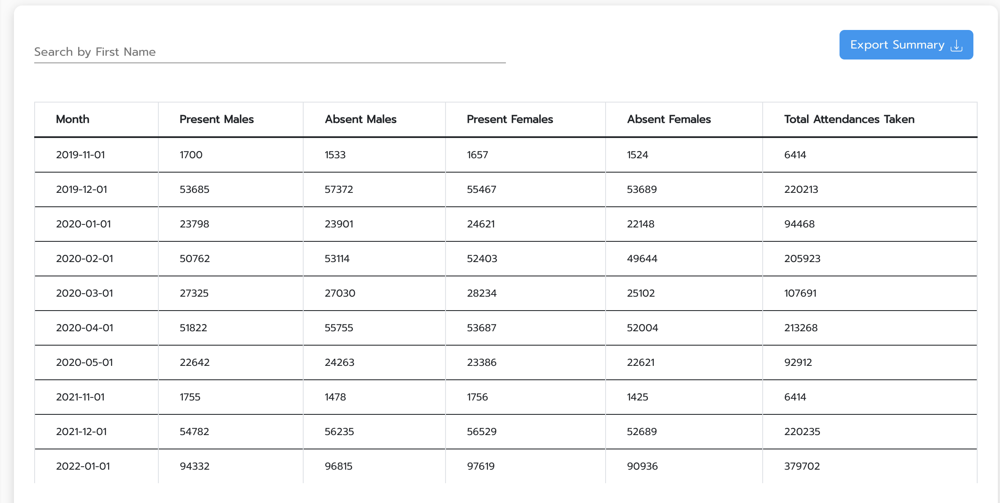

The downloads page shows a list of all previously exported report summaries as well as queued reports. Click the download button to download an excel report summary. 

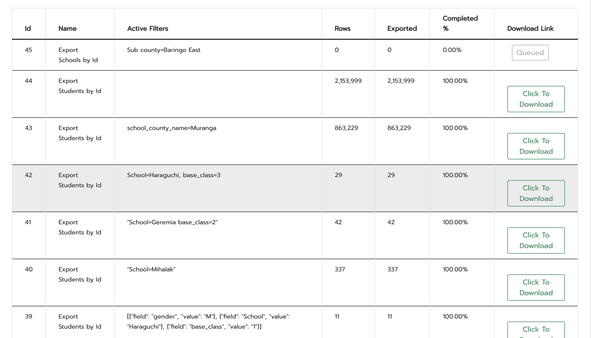

###### Settings

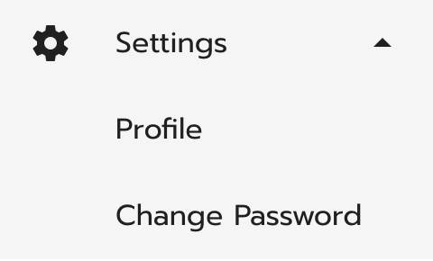

The profile settings show details of the logged in user and allows the changing of password. 

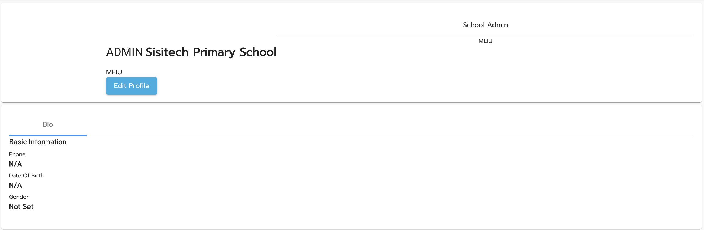

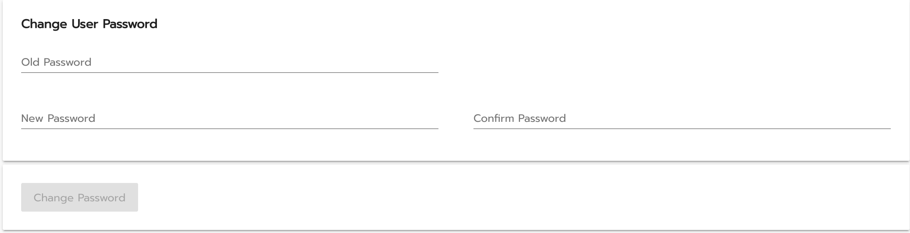

###### Full Screen Mode

Use fullscreen mode on the top right of the navigation menu to hide and unhide the toolbar, creating more space to view your data. 

###### Logout

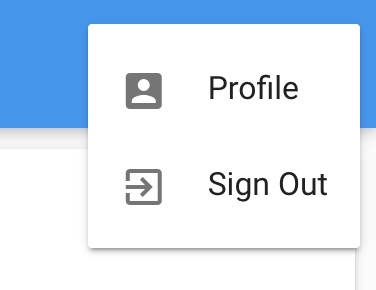

Logout by clicking on the user icon in the top right of the navigation bar. 